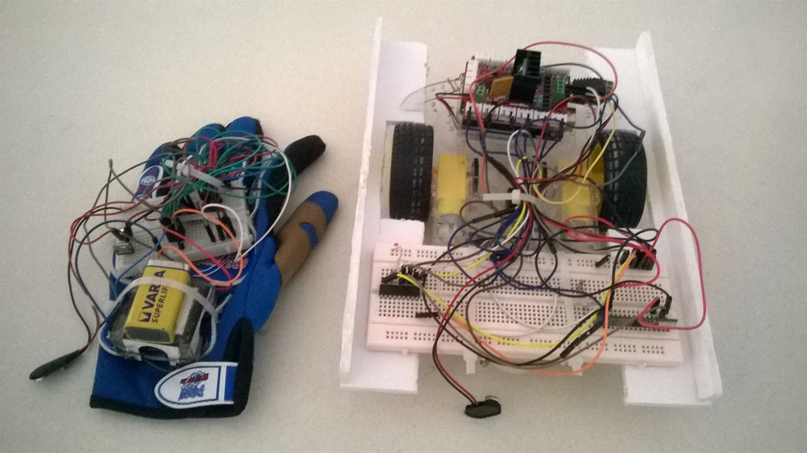

<h1>Hi, I'm Amine!  <a href="https://github.com/AmineDh98">Programmer</a>, <a href="https://www.linkedin.com/in/amine-dhemaied/">Robotics Software Engineer</a>
  

<h2>👨‍💻 Welcome to my Github profile</h2>

**An Erasmus Mundus Joint Master's Scholar in Intelligent Field Robotic Systems**

- 🔭 I’m currently working on my Master thesis project.
- 🌱 I’m currently learning ROS2, Jenkins and deep learning
- 📫 How to reach me: aminedhemaied98.ad@gmail.com

<h2>Languages and Tools:</h2>

 

<h2>Projects Gallery</h2>

<table>
  <tr>
    <td>
      
    </td>
    <td>
      
    </td>
    <td>
      
    </td>
  </tr>
</table>

<table>
  <tr>
    <td>
       <!-- Adjust width as needed -->
    </td>
    <td>
       
    </td>
    <td>
       
    </td>
  </tr>
</table>

<table>
  <tr>
    <td>
       <!-- Adjust width as needed -->
    </td>
    <td>
       <!-- Adjust width as needed -->
    </td>
    <td>
       <!-- Adjust width as needed -->
    </td>
  </tr>
</table>

<h2> 🤳 Connect with me:</h2>

[][youtube]
[][linkedin]

[youtube]: https://www.youtube.com/@aminedhemaied9857
[linkedin]: https://www.linkedin.com/in/amine-dhemaied/

